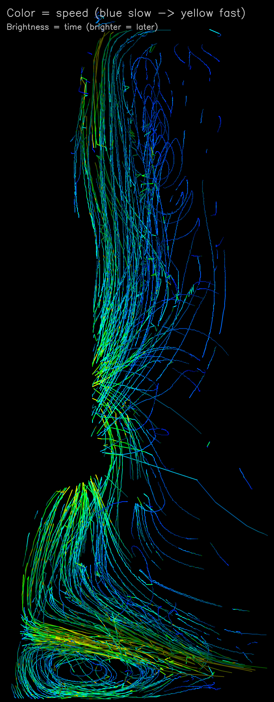
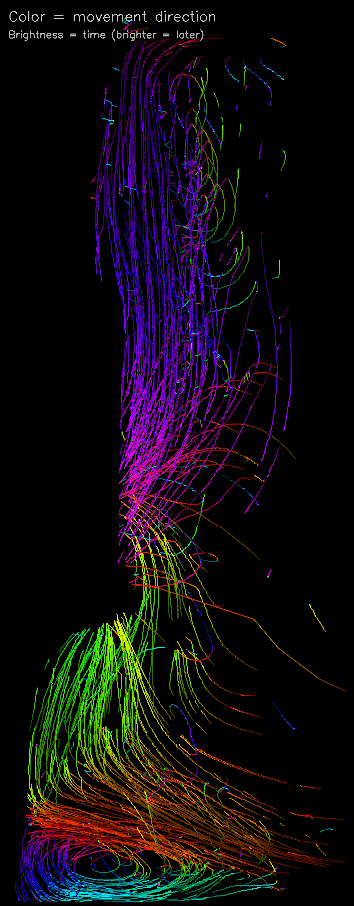
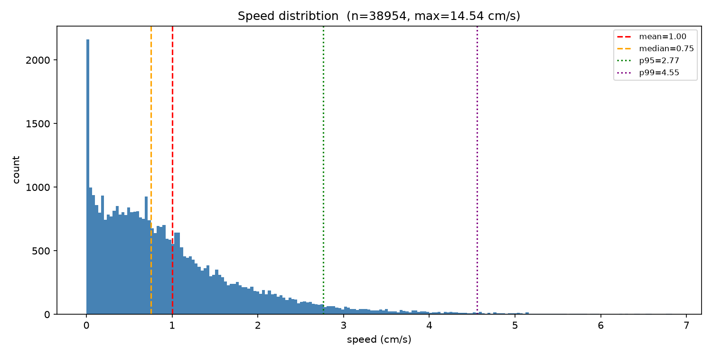
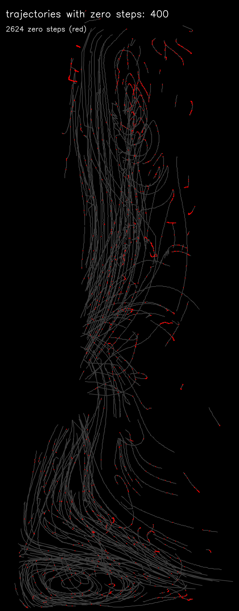
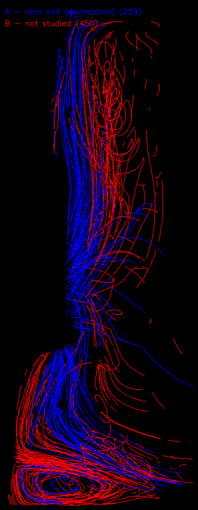
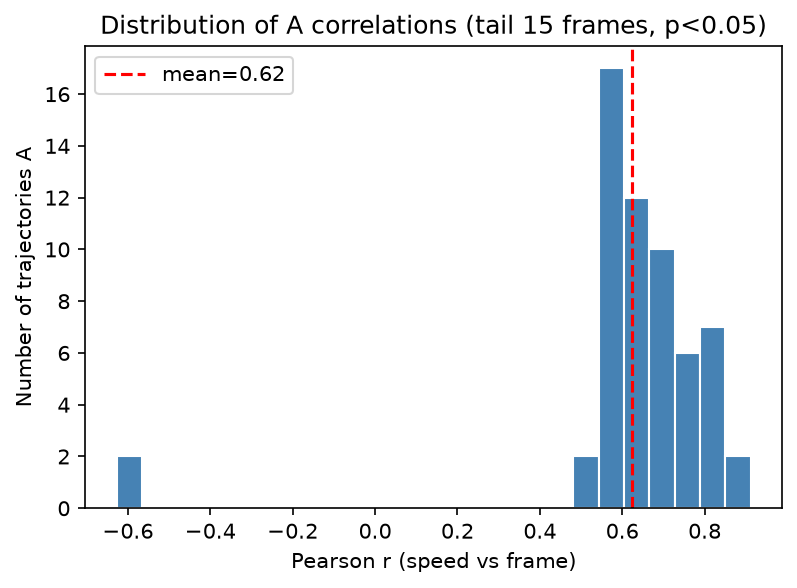

# Implementation of a PTV/PIV Pipeline for Flow Analysis

A Python pipeline that extracts, tracks and classifies particle motion from video recordings of water flowing down an inclined plane. It uses both **Particle Tracking Velocimetry (PTV)** with [TrackPy](http://soft-matter.github.io/trackpy/) and **Particle Image Velocimetry (PIV)** with [OpenPIV](https://openpiv.net/) to compute velocity fields and classify trajectories by their proximity to a user-defined exit line.

## Features

- Homographic calibration from a reference image (pixels into cm)
- Blue-channel extraction and polygon masking to isolate seeded particles
- Particle detection with configurable size and eccentricity filters
- Trajectory linking across hundreds of frames using TrackPy
- Spatiotemporal outlier detection using Delaunay triangulation
- Duplicate-frame detection and removal based on cross-correlation
- Velocity computation in cm/s using calibrated homography and timestamps
- Trajectory classification (group A = ends near exit line) with Pearson correlation analysis
- Diagnostic images: direction-coded, speed-coded, zero-step detection, category overlay, correlation histogram

## Prerequisites

- [Python](https://www.python.org/downloads/) 3.12
- [uv](https://docs.astral.sh/uv/getting-started/installation/) (recommended package manager) or pip

## Installation

```bash
git clone 
cd TB
uv sync
```

## Usage

```bash
uv run main.py
```

The pipeline guides you through three interactive steps on the first run:
1. **Calibration** -- Click 4 corners of the reference rectangle on `before.tif`.
2. **Mask** -- Draw a polygon around the region of interest on the first video frame.
3. **Exit line** -- Click 2 points to inform the convergence main line.

All subsequent runs reuse the saved calibration and frames.

### Pipeline steps

| Step | Description |
| --- | --- |
| Calibration | Computes homography from 4 user-selected corners on a reference image |
| Frame extraction | Extracts blue channel, applies mask, crops, saves `.tif` frames |
| Detection | Displays detected particles on the first two frames |
| PIV vs PTV | Shows side-by-side comparison of PIV grid and PIV/PTV vectors |
| Exit line selection | User clicks 2 points to define the classification exit line |
| Full PTV | Detects, tracks, cleans, computes velocities, renders all outputs |

### Output images

| File | Description |
| --- | --- |
| `results/trajectories_direction.png` | Trajectories color-coded by movement direction (HSV hue), brightness = time |
| `results/trajectories_speed.png` | Trajectories color-coded by speed (blue = slow, yellow = fast) |
| `results/trajectories_zeros.png` | Highlights zero-speed steps (< 0.05 cm/s) in red |
| `results/trajectories_categories.png` | Group A (blue) near exit line vs group B (red) not studied |
| `results/speed_distribution.png` | Histogram with mean, median, p95, p99 |
| `results/a_correlation_hist.png` | Pearson r distribution for group A trajectories |

### Standalone scripts

```bash
uv run dedup_frames.py <frames_dir>       # Remove duplicates frames from a directory
```

## Project Structure

```
.
├── main.py                  # Pipeline entry point
├── calibrate.py             # Homographic calibration from reference image
├── crop_tools.py            # Video frame extraction, masking, blue-channel isolation
├── dedup_frames.py          # Duplicate frame detection and removal
├── detect.py                # Particle detection with TrackPy
├── PTV.py                   # Trajectory linking, duplication removal, velocity computation
├── PIV.py                   # OpenPIV cross-correlation engine
├── selection.py             # Trajectory cleaning (outlier removal, filtering)
├── evaluate.py              # Exit line selection, classification, correlation analysis
├── vizualisation.py         # Output image generation
├── compare_PIV_PTV.py       # Side-by-side PIV/PTV vector comparison
├── files_utils.py           # Frame loading utility
├── pyproject.toml           # Project metadata and dependencies
├── uv.lock                  # Lock file for uv
├── before.tif               # Reference image for calibration
├── v3_slow.mp4              # Primary input video
├── frames/                  # Extracted frames and calibration data
└── results/                 # Output images (6 PNGs)
```

## Evaluation principle

The classification uses a **sink flow** model: particles are expected to converge toward a linear drain (the exit line) rather than a point sink. Trajectories whose endpoints lie within 30 px of the exit line are classified as group A and analysed for speed decay via Pearson correlation over the last 15 frames. The remaining trajectories (group B) are excluded from the correlation analysis.

## Preview













## Credits

- This README was built with assistance of [ChatGPT](https://chat.openai.com/)
- [TrackPy](http://soft-matter.github.io/trackpy/) for particle detection and linking
- [OpenPIV](https://openpiv.net/) for cross-correlation analysis
- [OpenCV](https://opencv.org/) for image processing and visualization
